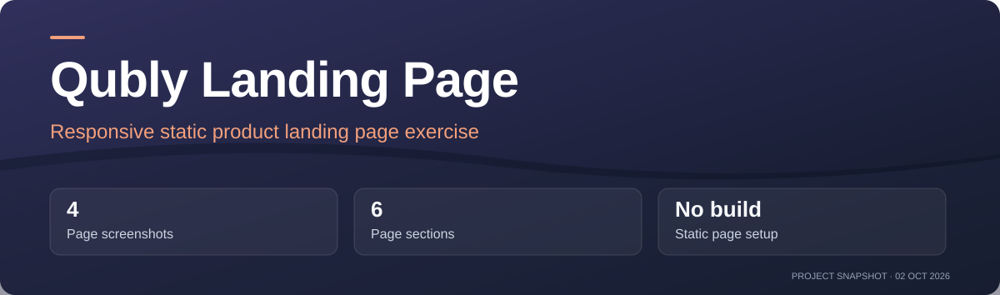
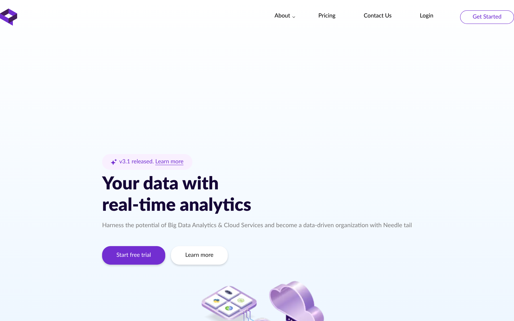
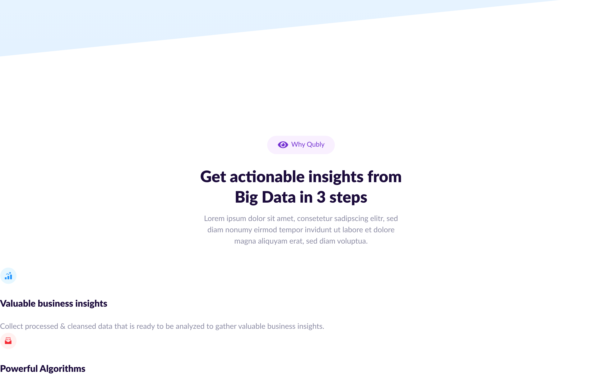
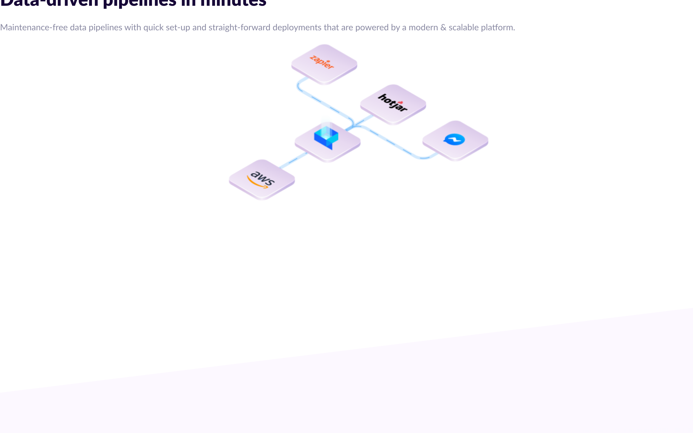
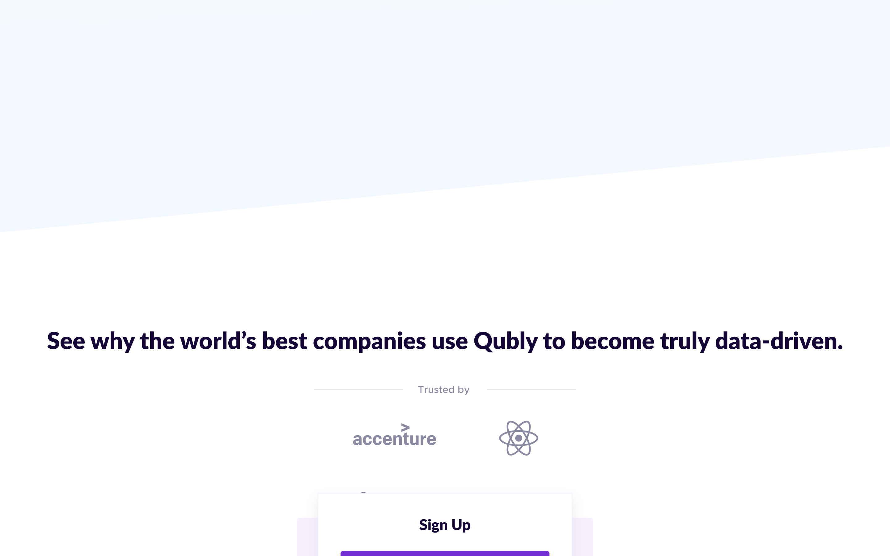

<!-- project-presentation:start -->



**[Open project](https://igor-vuta.github.io/qubly-landing/)** · [Repository activity](https://github.com/igor-vuta/qubly-landing/activity)

[](https://github.com/igor-vuta/qubly-landing/commits)
[](https://github.com/igor-vuta/qubly-landing)

**4** Page screenshots · **6** Page sections · **No build** Static page setup

_Project facts checked 2 October 2026. Activity badges update from GitHub._

<!-- project-presentation:end -->

# Qubly landing page

A responsive, single-page front-end exercise built with HTML, Sass/CSS, and jQuery. It recreates a product landing page with a hero, feature sections, reviews, and a closing call to action.

[View the page](https://igor-vuta.github.io/qubly-landing/)

<div align="center">
  
  
</div>

## What is in the project

- Responsive layouts in `css/main.css` and `css/adaptive.css`, with Sass sources in `sass/`.
- Anchor navigation and mobile menu behavior in `js/common.js`.
- Scroll reveals through the included Animate.css and WOW.js files.
- Local image assets in `img/`, plus bundled jQuery and Fancybox files in `libs/`.

The site is static and has no account system or backend. Its Qubly product copy, logos, testimonials, and the copyright notice in `index.html` are part of the page content; they are not claims about this repository's author or a live Qubly service.

## Run locally

From the repository root, serve the existing files:

```sh
python3 -m http.server 5173
```

Open <http://localhost:5173/>. There is no build step. Edit `index.html`, `sass/`, `css/`, or `js/common.js` directly; if changing Sass, regenerate the committed CSS with your Sass compiler.

## More views

<div align="center">
  
  
</div>

The repository includes an [AGPLv3 license](LICENSE). Bundled libraries and third-party brand assets retain their own notices and rights.
